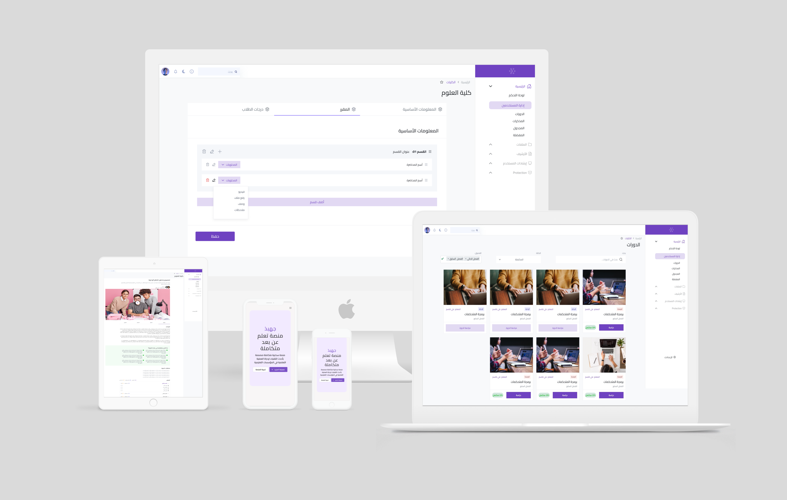

# Gahbaz(جهبذ)


<div align="center">

[](https://elearningsystem.onrender.com)

**منظومة متكاملة للجامعات والمؤسسات للتعليم عن بعد وإدارة العملية التعليمية.**

---

[](https://github.com/CS0Team/gahbaz/actions/workflows/deploy.yml)
[](#maintainers)
[](https://github.com/CS0Team/gahbaz/graphs/contributors/)


[](https://github.com/CS0Team/gahbaz/releases/latest)
[](https://github.com/CS0Team/gahbaz/blob/version-two/LICENSE)
[](https://github.com/CS0Team/gahbaz)
[](https://github.com/CS0Team/gahbaz/fork)

</div>


## **نظرة عامة على المشروع**

يعد هذا المشروع نظامًا للتعلم الإلكتروني مخصصًا لإدارة عمليات التعليم عن بُعد في الجامعات، بما في ذلك إدارة المحتوى الدراسي، الاختبارات، تتبع تقدم الطلاب، والتواصل الفوري بين الطلاب والمعلمين. يدعم النظام عدة أدوار للمستخدمين: الطلاب، المعلمون، والمسؤولون، ويعتمد على تقنيات حديثة لضمان الأداء الأمثل والتوسع وتجربة المستخدم الممتازة.

[النسخة الإنجليزية لملف README](README.EN.MD)

## **الميزات الرئيسية**
- **الأدوار**: مسؤول النظام، المعلمون، الطلاب
- **إدارة الدورات**: إنشاء وتحديث وإدارة المحتوى الدراسي
- **إدارة الفصول الدارسية**: إدرة الفصول الدارسية وجدولتها بضغطة زر حيث يكون كل شيءٍ جاهز
- **تقديم المهام**: يمكن للطلاب تقديم المهام، ويمكن للمعلمين مراجعتها
- **الدردشة في الوقت الفعلي**: تواصل فوري بين الطلاب والمعلمين باستخدام **Socket.IO**
- **نظام الإشعارات**: إشعارات فورية للمستخدمين
- **تخزين سحابي**: تخزين الوسائط مثل المحاضرات والاختبارات باستخدام **Cloudinary**
- **تحليلات وتقارير**: إنشاء تقارير الأداء للطلاب
- **واجهة مستخدم متجاوبة بالكامل**: تم تصميم الواجهة باستخدام **Mantine UI**
- **أُستضيف المشروع باستخدام Render**

---

## **التقنيات المستخدمة**

### **الخلفية (Backend)**:
- **Node.js** و **Express.js**: لبناء واجهة برمجة التطبيقات (API) والتعامل مع الاتصالات الفورية
- **MongoDB**: قاعدة بيانات NoSQL لتخزين بيانات المستخدمين والدورات الدراسية والاختبارات
- **Mongoose**: ORM لإدارة قواعد البيانات MongoDB
- **Socket.IO**: للتواصل الفوري ثنائي الاتجاه للدردشة المباشرة
- **JWT Authentication**: نظام توثيق آمن باستخدام رموز JWT

### **الواجهة الأمامية (Frontend)**:
- **React.js**: هيكلية تطبيقات صفحات الويب الأحادية (SPA) لتجربة مستخدم ديناميكية وسريعة
- **Mantine UI**: مكتبة مكونات لتصميم واجهات متجاوبة وقابلة للوصول
- **React Query**: لجلب البيانات بكفاءة وتخزينها مؤقتًا ومزامنة حالة الخادم
- **Socket.IO Client**: للتواصل الفوري بين المستخدمين

### **الخدمات السحابية (Cloud Services)**:
- **Cloudinary**: تخزين الوسائط لإدارة الصور والفيديوهات
  - [رابط Cloudinary](https://cloudinary.com)

### **التصميم وإدارة المشروع**:
- **Figma**: لتصميم واجهات المستخدم (UI/UX) والمخططات النظامية
  - [تصاميم الواجهات](https://www.figma.com/file/ynGrVrMF4UM9r9q6wVuwmB/ElearningSystem?type=design&amp;mode=design&amp;t=zUvpF1mkzI0gMjbk-1)
  - [مخططات النظام(UML)](https://www.figma.com/file/ynGrVrMF4UM9r9q6wVuwmB/ElearningSystem?type=design&amp;mode=design&amp;t=zUvpF1mkzI0gMjbk-1)

- **Jira**: أداة لإدارة المشاريع وتتبع المهام
  - [رابط Jira](https://www.atlassian.com/software/jira)

### **النشر و DevOps**:
- **GitHub**: للتحكم في الإصدار والتعاون
  - [مستودع GitHub](https://github.com/CS0Team/Gahbaz)
- **Render**: منصة استضافة للواجهة الخلفية والأمامية
  - [رابط Render](https://render.com)

---

## **نظام الدردشة في الوقت الفعلي**

يتضمن النظام ميزة **الدردشة في الوقت الفعلي** التي تتيح للطلاب والمعلمين التواصل على الفور. يتم تشغيل هذه الميزة باستخدام **Socket.IO**، الذي يسهل الاتصال الفوري ثنائي الاتجاه بين الواجهة الأمامية والخلفية.

### **نظرة عامة على Socket.IO**:
- **الخلفية (Node.js + Socket.IO)**: إدارة الاتصالات والأحداث بين المستخدمين (الطلاب والمعلمون).
- **الواجهة الأمامية (React + Socket.IO Client)**: إرسال الرسائل الفورية وتحديث واجهة الدردشة في الوقت الفعلي.

---

## **هيكلية النظام**

### **الهيكلية عالية المستوى**
يتكون النظام من:
1. **الواجهة الأمامية (React)**: تتفاعل مع الخلفية عبر API و Socket.IO، وتتعامل مع التوجيه وعرض الواجهة.
2. **الواجهة الخلفية (Node.js, Express)**: تعمل كموفر لواجهات برمجة التطبيقات (API)، وتتصل بقاعدة بيانات MongoDB، وتتعامل مع منطق العمل والدردشة الفورية باستخدام Socket.IO.
3. **قاعدة البيانات (MongoDB)**: تخزن جميع بيانات المستخدمين، الدورات الدراسية، الاختبارات، المحادثات.
4. **التخزين السحابي (Cloudinary)**: تخزين الملفات مثل الصور والفيديوهات التي يرفعها المستخدمون.

يمكنك عرض **مخطط النظام** الكامل [هنا على Figma](https://www.figma.com/system-diagram).

### **هيكل قاعدة البيانات**
الكيانات الرئيسية لقاعدة البيانات:
- **المستخدمون**: تخزين بيانات الطلاب والمعلمين والإداريين
- **الدورات الدراسية**: تخزين تفاصيل الدورات والمنهج الدراسي والمواد
- **الاختبارات**: تخزين تفاصيل الاختبارات والأسئلة والأجوبة
- **التقديمات**: تقديمات الطلاب للمهام والاختبارات
- **الرسائل**: تخزين رسائل الدردشة بين المستخدمين

---

## **بنية الملفات**

```
Gahbaz/
├── client/             # يحتوي على كود الواجهة الأمامية (React)
├── configs/            # ملفات التكوين (مثل متغيرات البيئة واتصالات قواعد البيانات)
├── controllers/        # المنطق لمعالجة الطلبات، يربط بين المسارات والنماذج
├── errors/             # معالجات الأخطاء المخصصة والفئات لإدارة الأخطاء
├── learn/              # يتعامل مع وظائف التعلم الإلكتروني، مثل الدورات والدروس وغيرها
├── middleware/         # وظائف الوسيط لمعالجة التوثيق وتسجيل الأحداث ومعالجة الطلبات
├── models/             # المخططات والنماذج الخاصة بقاعدة البيانات (Mongoose)
├── node_modules/       # التبعات المثبتة باستخدام npm
├── package.json        # بيانات المشروع والسكربتات
├── package-lock.json   # إصدارات التبعات المقفلة لضمان التثبيت المتسق
├── public/             # الملفات الثابتة للواجهة الأمامية
├── README.MD           # توثيق المشروع وتعليمات الإعداد
├── routes/             # تعريف نقاط النهاية لـ API ومنطق معالجة المسارات
├── screenshot.png      # لقطة شاشة للتوثيق أو لأغراض العرض التوضيحي
├── server.js           # نقطة دخول لخادم الواجهة الخلفية (Node.js و Express)
└── utils/              # دوال مساعدة للاستخدام العام عبر الواجهة الخلفية
```

---

## **التثبيت والإعداد**

### **1. نسخ المستودع**:
```bash
git clone https://github.com/your-repository/elearning-system.git
cd elearning-system
```

### **2. تثبيت المتطلبات**:
```bash
npm run setup-project
```

### **3. إعداد متغيرات البيئة**:
قم بإنشاء ملف `.env` في الدليل الرئيسي:
```
MONGO_URI=<رابط الاتصال بقاعدة بيانات MongoDB>
CLOUDINARY_CLOUD_NAME=<اسم السحابة في Cloudinary>
CLOUDINARY_API_KEY=<مفتاح API في Cloudinary>
CLOUDINARY_API_SECRET=<الرمز السري في Cloudinary>
```

### **4. تشغيل المشروع**:
```bash
npm run dev
```

سيؤدي هذا الأمر إلى تشغيل الخوادم الأمامية والخلفية في نفس الوقت. ستكون ميزة الدردشة الفورية متاحة بمجرد تشغيل التطبيق.

---

## **النشر على Render**

تم نشر المشروع باستخدام **Render**:
- الخلفية: [رابط API](https://your-api-url.onrender.com)
- الواجهة الأمامية: [التطبيق المباشر](https://your-app-url.onrender.com)

يمكنك الرجوع إلى [وثائق Render](https://render.com/docs) للحصول على تفاصيل النشر.

---

## **الميزات والوظائف**

### **نظام التوثيق وإدارة الأدوار**:
- التوثيق باستخدام JWT
- صلاحيات مختلفة للمسؤولين والمعلمين والطلاب

### **إدارة الدورات الدراسية**:
- يمكن للمعلمين إنشاء وتحديث وحذف الدورات الدراسية.
- يمكن للطلاب عرض الدورات الدراسية والتسجيل فيها.

### **الاختبارات والمهام**:
- يمكن للمعلمين إنشاء اختبارات مع تقييم تلقائي.
- يمكن للطلاب تقديم المهام، ويمكن للمعلمين مراجعتها وتقييمها.

### **الدردشة في الوقت الفعلي (Socket.IO)**:
- يمكن للطلاب والمعلمين الدردشة في الوقت الفعلي.
- إشعارات للرسائل الجديدة وتحديثات فورية عند إرسال الرسائل.

### **نظام الإشعارات**:
- إشعارات فورية للطلاب والمعلمين (المهام، الدرجات).

### **تكامل التخزين السحابي (Cloudinary)**:
- يستخدم Cloudinary لتخزين الملفات الوسائطية (المحاضرات، المهام).
- [وثائق Cloudinary](https://cloudinary.com/documentation)

### **التقارير والتحليلات**:
- يمكن للمعلمين والمسؤولين إنشاء تقارير الأداء للطلاب.

---

## **مراحل المشروع**

### **المرحلة 1: التخطيط وجمع المتطلبات**
- **الناتج**: متطلبات المشروع بالتفصيل، قصص المستخدم، والهيكلية الأولية في Figma.
  - رابط تصاميم Figma: [Figma Wireframes](https://www.figma.com/your-project-wireframes)

### **المرحلة 2: إعداد الواجهة الخلفية**
- **الناتج**: إعداد واجهة برمجة التطبيقات (API) باستخدام Node.js وExpress، وقاعدة بيانات MongoDB، ونظام توث

يق JWT.
- إعداد Socket.IO للدردشة في الوقت الفعلي.

### **المرحلة 3: تطوير الواجهة الأمامية**
- **الناتج**: تطوير الواجهة الأمامية باستخدام React.js و Mantine UI، ودمج React Query لجلب البيانات من الواجهة الخلفية.

### **المرحلة 4: النشر والاختبار**
- **الناتج**: نشر التطبيق على Render، وإجراء اختبارات شاملة.

### **المرحلة 5: التحسين والتكامل**
- **الناتج**: تحسينات على أداء التطبيق، وتكامل التخزين السحابي (Cloudinary).

---

## **المراجع**:
- [توثيق Socket.IO](https://socket.io/docs/)
- [توثيق Mantine UI](https://mantine.dev/)
- [توثيق React Query](https://react-query.tanstack.com/)
- [رابط Cloudinary](https://cloudinary.com)
- [رابط Jira](https://www.atlassian.com/software/jira)
- [وثائق Render](https://render.com/docs)
